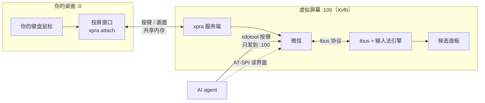

# wechat-linux-agent

给 AI agent 准备一个能操作 Linux 版微信的环境，同时不抢你的键盘和鼠标。

微信跑在一块独立的虚拟屏幕上，agent 在那里读界面、发按键；你通过投屏窗口照常使用微信。本项目只负责这套环境（虚拟屏幕、投屏、输入法适配），不包含 agent 本身。

> English summary: run Linux WeChat on a headless Xvfb display, project it to your desktop with xpra, and so an agent can read the UI via AT-SPI and type via xdotool on the virtual display only, without hijacking your own keyboard and mouse. Includes fixes for Chinese input methods (ibus) on the virtual display. The agent itself is not included.

## 为什么要虚拟屏幕

直接在桌面上让 agent 操作微信时，你和 agent 共用同一个键盘焦点和剪贴板。你正在别的窗口打字时，agent 的按键可能落进你的窗口；agent 打字时，你的按键也可能混进微信，甚至把消息发错人。

把微信放到虚拟屏幕上以后，两边的输入就分开了：



- **agent 的按键**只发到 `:100`，不会进入你桌面上的其他程序。
- **你的按键**经投屏窗口进入微信。发消息前 agent 可以先断开投屏（`wechat-iso detach`），发完再接上，这期间你的输入不会混进来。
- **候选词窗口**也画在虚拟屏幕上，随投屏一起显示在你桌面上。

## 组成

| 路径 | 作用 |
|---|---|
| `bin/wechat-iso` | 一条命令起停整套环境：Xvfb、xpra、输入法、微信、投屏。每个部分都是 `systemd --user` 的临时服务，不依赖终端会话 |
| `share/ime/ibus/` | 输入法适配：候选面板启动包装和 `pango-null-guard`（绕过 Ubuntu 24.04 的面板崩溃） |
| `share/winstate.py` | 在虚拟屏幕一侧还原窗口状态（`wechat-iso normal` 用到） |
| `docs/` | 原理、输入法适配、排错记录 |

## 环境要求

已验证的环境：WSL2（WSLg）上的 Ubuntu 24.04，微信 Linux 4.1（英文界面），xpra 6.5.4。普通 Linux 桌面原理相同，但没有实测。目前只在作者的环境里验证过（微信通过自定义启动器运行），默认的直接启动方式还没有在干净环境里跑过，欢迎反馈。

- 开启了 systemd 的用户会话（WSL 需要在 `/etc/wsl.conf` 里设置 `systemd=true`）
- `xvfb xdotool xclip python3-pyatspi at-spi2-core`，以及 C 编译器（编译防护库）
- **xpra 6.x，从 [xpra.org 官方软件源](https://github.com/Xpra-org/xpra/wiki/Download) 安装**。Ubuntu 24.04 自带的 xpra 3.1.5 和系统里的 Python 不兼容，用不了
- 输入法：ibus 和一个中文引擎（`ibus-libpinyin`、`ibus-rime` 等都可以）。fcitx5 是实验性支持，见 [docs/ime.md](docs/ime.md)

```bash
sudo apt install xvfb xdotool xclip python3-pyatspi at-spi2-core build-essential ibus ibus-libpinyin
# 再按 xpra.org 的说明添加软件源并安装 xpra
```

## 快速开始

```bash
git clone <this repo> && cd wechat-linux-agent
./install.sh                              # 装到 ~/.local，生成 ~/.config/wechat-iso/config.sh
$EDITOR ~/.config/wechat-iso/config.sh    # 至少确认 WX_CMD 和 WX_IBUS_ENGINE
wechat-iso up                             # 桌面上出现 "Weixin on :100" 窗口，在里面扫码或点登录
```

常用命令：

| 命令 | 作用 |
|---|---|
| `wechat-iso up` | 启动全部组件，已经在运行的会跳过 |
| `wechat-iso status` | 查看各组件状态和当前输入法引擎 |
| `wechat-iso detach` / `attach` / `reattach` | 断开、接上、重接投屏。微信不受影响 |
| `wechat-iso normal` | 窗口卡在最大化或看不见时，恢复成普通窗口 |
| `wechat-iso down` | 关闭全部组件，撤销对系统的改动 |

## 给 agent 的接口

agent 只需要两样东西，都在虚拟屏幕上：

- **读界面：** 微信以 `QT_LINUX_ACCESSIBILITY_ALWAYS_ON=1` 启动，会注册到 AT-SPI。用 `python3-pyatspi` 遍历应用名为 `wechat` 的节点，就能拿到按钮、输入框、聊天列表的文字和位置，不需要截图。
- **输入：** `DISPLAY=:100 xdotool ...` 发按键和点击，只会进入虚拟屏幕。中文用 `DISPLAY=:100 xclip -selection clipboard` 写剪贴板再 `ctrl+v` 粘贴（`xdotool type` 打不出中文）。注意投屏开着时剪贴板会同步到你的桌面。

建议 agent 发消息前先 `wechat-iso detach` 断开投屏，避免你的输入混进来；按回车前再核对一次焦点所在的输入框和里面的文字，发完再 `wechat-iso attach`。

## 已知问题

- **投屏窗口的“还原”和“最小化”不起作用**（WSLg 不理会这两个请求），最大化可以。窗口卡住时运行 `wechat-iso normal`。
- 更多排错记录见 [docs/troubleshooting.md](docs/troubleshooting.md)。

## 声明

这是非官方项目，与腾讯无关。自动化操作微信可能违反微信的服务条款，账号可能因此受限，请自行评估风险。请只用于自己的账号和正常沟通，不要用于群发、营销或骚扰。

## 许可

MIT
